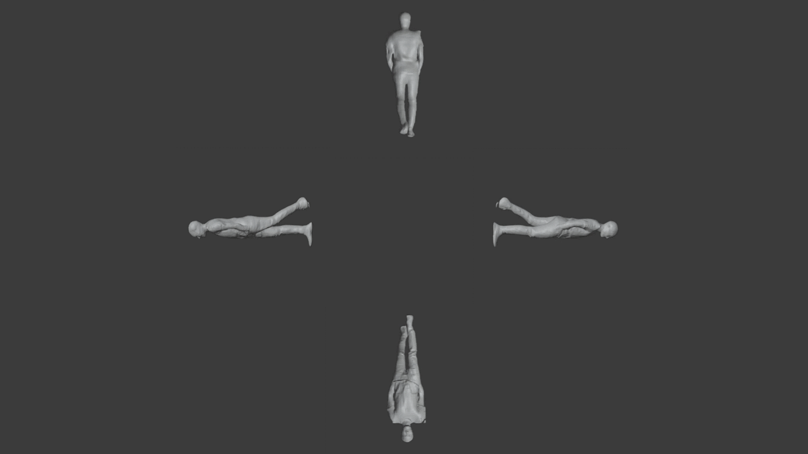

  
    
  
  
  
  

### New Info Hoarding and Delivery:
# Rendering Multidimensional Hologram from Flat Artifacts

## 🗂️ Table of Contents
- [About](#%EF%B8%8F-about)
- [How to Use](#-how-to-use)

## 🖥️ About

The goal of this project was to develop 3D Holographic Technology in a user-friendly and cost-effective way, or wherever else applicable. The first route I tested was photogrammetry, however the computation times for that method were too high for my intended purposes, and the setup was tedious since you'd have to take pictures of your object from numerous different angles. I decided to use Artificial Intelligence to help me out.

With the use of a framework called [PIFuHD](https://github.com/facebookresearch/pifuhd), I could successfully turn a single image into a 3D model, which I could later turn into a hologram. However, I needed to do this for entire videos, lectures for example. I would need to write my own program to help out. I used Python and [OpenCV](https://opencv.org/) to achieve my goal. With OpenCV, I could read a video, crop it into PIFuHD's required frame size, downscale it for quicker computation time, and sample it into frames by a customizable inerval. I could then use Python's built-in [OS](https://docs.python.org/3/library/os.html) module to interact with PIFuHD, by sending it these frames and getting each one developed into a 3D model in the form of .obj files.

I then took all of the .obj files and played them one after another using [Unity](https://unity.com/), where I displayed them into an holographic illusion technique called [Pepper's Ghost](https://en.wikipedia.org/wiki/Pepper%27s_ghost). This technique has been used in larger-scale applications such as live concerts, television, museums, and more, so there was no reason it couldn't make its way into classrooms and workplaces. This repository is only for the code section of my Bachelor Project, therefore the [How to Use](#-how-to-use) section reflects just that. You'll need more supplies and other software for the hologram itself, including [Unity](https://unity.com/).

## 📝 How to Use

To use this program, you'll need:
1. [Python](https://www.python.org/)
2. [Anaconda](https://www.anaconda.com/)
3. [PIFuHD](https://github.com/facebookresearch/pifuhd)
4. An IDE of your choosing, I would recommend [VSCode](https://code.visualstudio.com/) or [PyCharm](https://www.jetbrains.com/pycharm/)
5. A video you want to turn into 3DHT, I used [this one](https://www.youtube.com/watch?v=tvdEO4dlgJY)

[Back to top](#top)
